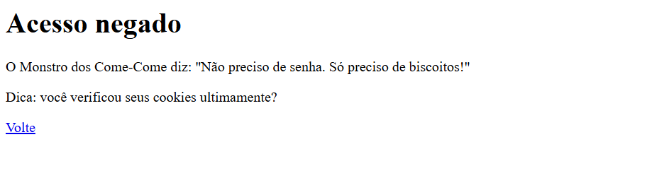
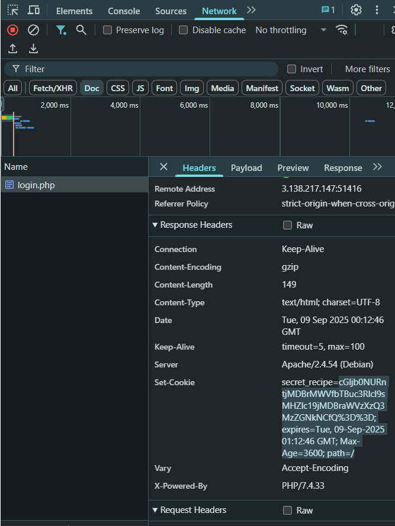
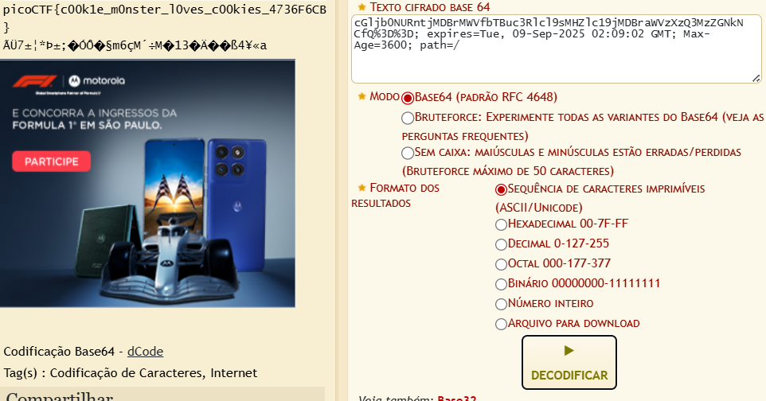

###### Solved by @felipebonamicheelias

> This is a CTF about Cryptography

## Desafio: Receita Secreta do Monstro dos Biscoitos
#### Introdução

Este é um desafio disponível na plataforma [picoCTF](https://play.picoctf.org/). O exercício tem como objetivo introduzir o conceito de cookies em aplicações web, mostrando como informações sensíveis podem ser armazenadas (ou escondidas) neles

- [Página do desafio](https://play.picoctf.org/practice/challenge/469)

O enunciado nos apresenta uma página simples de login, mas sem pistas óbvias. O desafio está em inspecionar o comportamento da aplicação e descobrir a flag escondida nos cookies.

#### Análise Inicial

Ao acessar a página, vemos apenas uma tela de login.  
Ao tentar realizar qualquer tipo de acesso, o usuario é direcionado para a pagina "Acesso negado"  
  
**

Além disso, há três dica:

> *"Às vezes, as informações mais importantes estão escondidas à vista de todos. Você verificou todas as partes da página?"*

> *"Os cookies não servem apenas para comer: eles também são usados ​​em tecnologias da web!"*

> *"Os navegadores da Web geralmente têm ferramentas que podem ajudar você a inspecionar vários aspectos de uma página da Web, incluindo coisas que você não pode ver diretamente."*

#### Solução

Para resolver este desafio, fui no inspecionar da pagina entrei em rede/login.php e la estava um mensagem criptografada assim como na imagem:

então usei o site [dcode](https://www.dcode.fr/cipher-identifier) para decriptografar a mensagem:

#### Conclusão

Flag:
>`picoCTF{c00k1e_m0nster_l0ves_c00kies_4736F6CB}`

Este desafio demonstrou de forma prática como informações sensíveis podem ser armazenadas nos cookies de um site e como é possível recuperá-las utilizando ferramentas básicas de inspeção do navegador e técnicas de decodificação.

Ao investigar o cookie recipe, percebemos que o seu conteúdo estava codificado em Base64, o que exigiu apenas uma simples decodificação para revelar a flag.

O exercício reforça conceitos importantes de segurança web: mesmo informações aparentemente inofensivas, quando armazenadas em cookies, podem conter dados valiosos. Isso ressalta a importância de tratar e proteger corretamente dados sensíveis em aplicações web, e ao mesmo tempo fornece uma introdução prática à análise de cookies em contextos de CTFs.