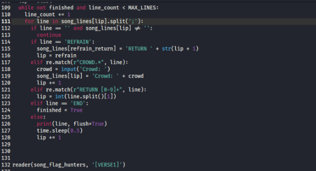
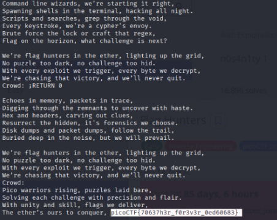

###### Solved by @felipebonamicheelias

> This is a CTF about Cryptography

## Desafio: Flag Hunters
#### Introdução

Este desafio da plataforma [picoCTF](https://play.picoctf.org/)
envolve análise de um programa que exibe letras de música. O objetivo é interagir com o programa de modo a revelar a flag oculta, manipulando o fluxo da execução por meio de entradas estratégicas.

#### Análise Inicial

O programa lê as linhas da música e faz um split pelo caractere ";", gerando diferentes partes da canção. Ele também possui comandos especiais como RETURN[0-9], que fazem o código voltar a uma determinada linha da música.

Ao analisar o código, percebemos que:

> *Cada linha da música é processada sequencialmente.*

> *Ao encontrar RETURN 0, a música inteira é reproduzida 
novamente.*

> *Quando o programa solicita o input do CROWD, é possível influenciar o fluxo da música.*

#### Solução

A solução consistiu em explorar a divisão das partes da música e o comando RETURN para forçar a execução até a flag.
Quando o programa solicitava a entrada do CROWD, aproveitamos uma vulnerabilidade na forma como as linhas da música eram processadas.

Inserimos a seguinte entrada ";RETURN0". O ponto e vírgula (;) permite injetar comandos adicionais dentro da divisão feita pelo split(';'), enquanto o "RETURN0" reinicia a música desde o início, fazendo com que o programa percorra todas as linhas até chegar ao ponto onde a flag estava oculta. Ao enviar ";RETURN0" no input do CROWD, conseguimos controlar o fluxo do programa e forçá-lo a revelar a flag.

#### Conclusão

Flag:
>`picoCTF{70637h3r_f0r3v3r_0ed60683}`

Este desafio mostra a importância de compreender como o fluxo de um programa pode ser manipulado. Através de análise do código e da observação da estrutura de dados (no caso, o split pelo ;), conseguimos forçar o programa a executar trechos críticos e revelar informações ocultas.

Além disso, reforça conceitos importantes em CTFs de Reverse Engineering, como injeção de comandos e exploração de fluxos de controle.