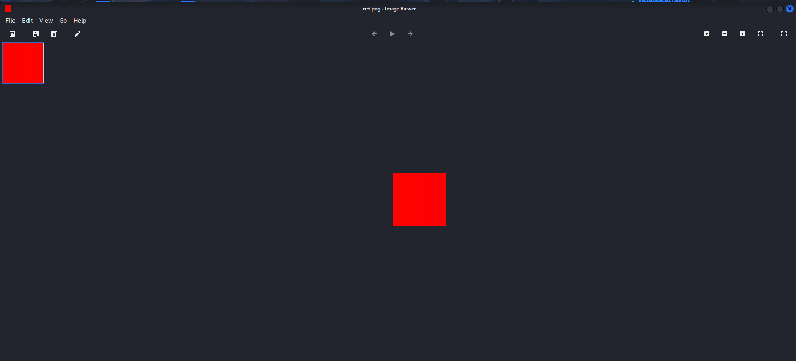
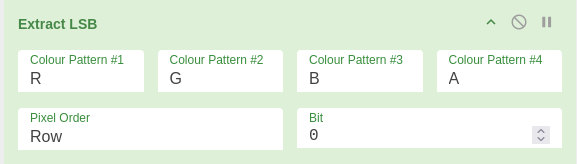

###### Solved by @felipebonamicheelias

> This is a CTF about Cryptography

## Desafio: Red
#### Introdução

Esse desafio do picoCTF deu pra gente só uma imagem chamada red.png.
Na descrição, tinha várias vezes a palavra RED (vermelho) 

#### Análise Inicial

Quando abrimos a imagem, parecia só um quadrado vermelho sem nada entao pensei que a flag poderia estar escondida dentro do arquivo 

Alem disso no enunciado da questao havia umas dicas estranhas tipo:

“A imagem parece pura, mas será que é mesmo?”

“Red? Ged? Bed? Aed?”

“Veja no que o Facebook se chama agora”

Ou seja, dava a entender que o segredo não estava visível, mas escondido dentro da imagem.

#### Solução

A solução consistiu em aplicar as decodificações na imagem utilizando a extração LSB, usando uma ferramenta do site [Cyberchef](https://gchq.github.io/CyberChef/)

o codigo gerado eu inseri ele no site [dcode](https://www.dcode.fr/cipher-identifier) para identificar a criptografia que estava em base64

#### Conclusão

Flag:
>`picoCTF{r3d_1s_th3_ult1m4t3_cur3_f0r_54dn355_}'

O aprendizado principal foi entender que em CTFs de esteganografia e criptografia, o conteúdo “escondido” pode estar em diferentes camadas: primeiro dentro da própria imagem, depois em um formato codificado (Base64).Esse processo em etapas mostrou a importância de testar ferramentas e não desistir na primeira análise.